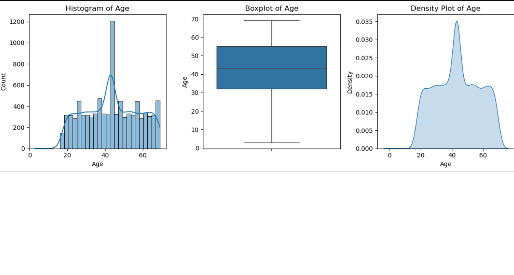
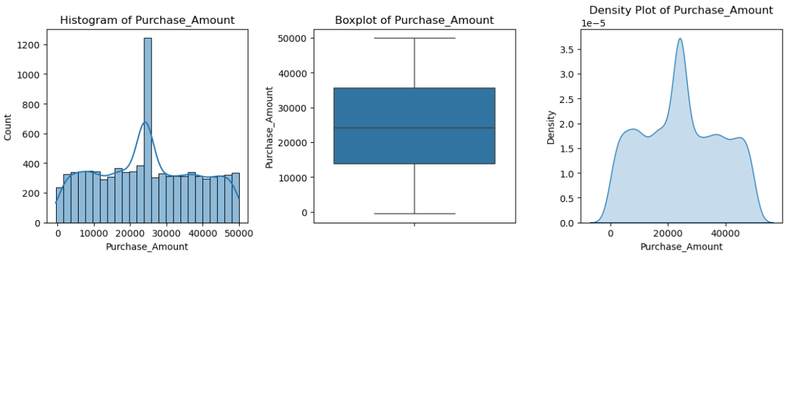
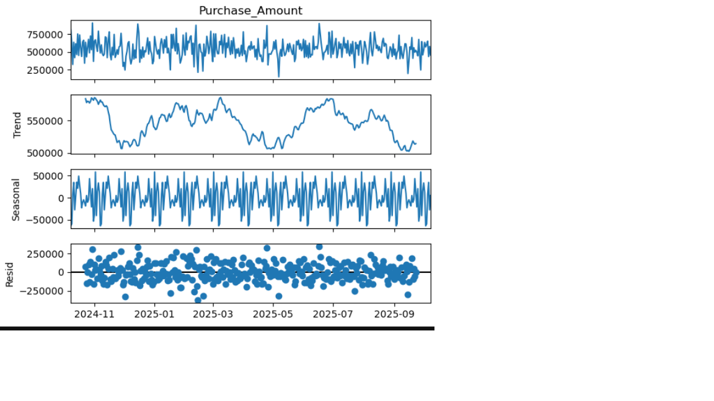
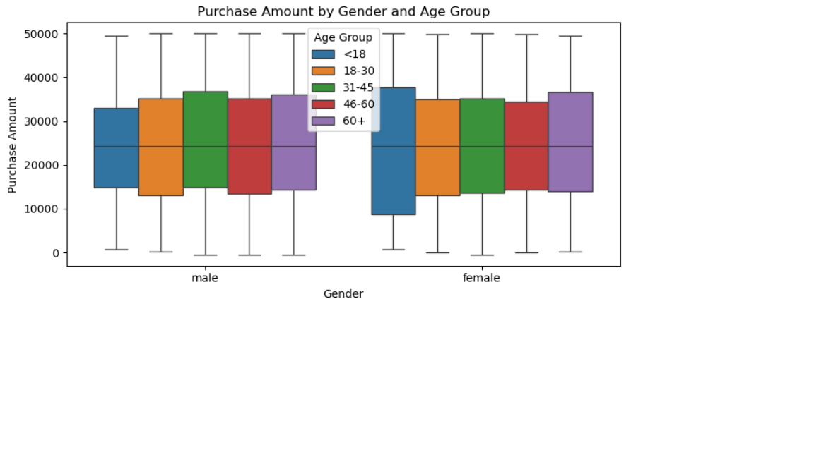
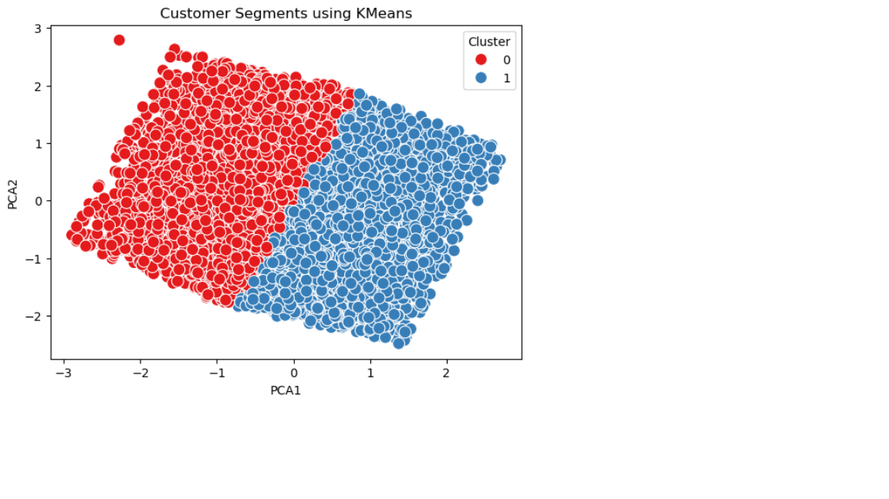
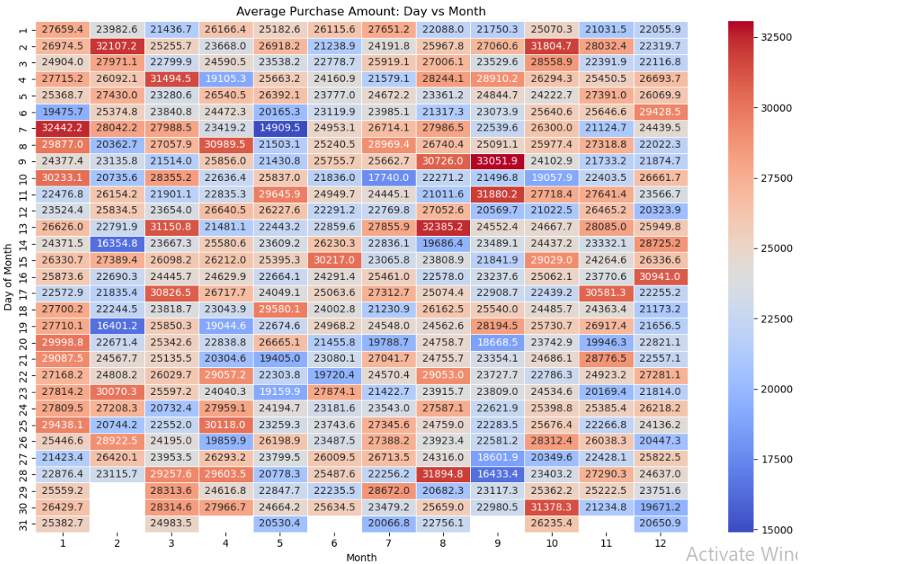

# Customer Data Analysis

## 📌 Project Overview
This project analyzes customer data to understand purchasing behavior, identify key trends, and uncover actionable insights that can support data-driven marketing and customer engagement strategies.

## 📌 Data Cleaning & EDA
Cleaned and validated customer data by handling missing values, duplicates, data types, inconsistencies, and outliers, followed by exploratory data analysis to identify customer behavior patterns, trends, and key insights.
---

## 💡 Objectives
* Analyze customer demographics and purchasing behavior
* Identify trends and patterns in customer engagement
* Evaluate factors influencing purchases and conversions
* Generate actionable insights to support marketing decisions
---

---

## Python Libaries Used
### *pandas, numpy, seaborn, matplotlip, datetime*

---
## 💡 Key Analysis Areas

* Customer demographics
* Purchase behavior
* Product and category performance
* Discounts and promotions
* Subscription and engagement patterns
* Customer ratings and feedback
----
### 1. Numerical Feature Distribution Analysis

Analyzed numerical variables using histograms, boxplots, and density plots to understand data distribution, identify skewness, and detect potential outliers.

Business Usage: Helps identify customer spending patterns, unusual transactions, data-quality issues, and customer segments to support targeted marketing and data-driven decision-making.

### 2. Time-Series Decomposition

Aggregated daily purchase amounts and applied 30-day seasonal decomposition to separate the data into trend, seasonal, and residual components.

Business Usage: Helps identify purchasing trends, recurring monthly patterns, and unusual fluctuations to support sales forecasting, campaign planning, and inventory decisions.

### 3. Customer Segmentation by Age and Gender

Created age groups and used boxplots to compare purchase amounts across age groups and gender.

Business Usage: Helps identify differences in spending behavior across customer segments, supporting targeted marketing, customer segmentation, and personalized promotions.

### 4.Customer Segmentation Using K-Means

Applied K-Means clustering on PCA-transformed customer data to identify distinct customer segments and visualized the clusters using PCA components.

Business Usage: Helps group customers with similar behaviors to support targeted marketing, personalized offers, customer retention, and campaign optimization.

### 5. Purchase Pattern Heatmap

Created a day-by-month heatmap to analyze average purchase amounts across different calendar periods.

Business Usage: Helps identify high-performing purchase periods and seasonal spending patterns, supporting marketing campaign timing, promotions, and sales planning.

----
## 📁 Repository Files
* 🖼️ [`DataCleaningProcess.ipynb`](Notebook/DataCleaningProcess.ipynb) — Data Cleaning Notebook.
* 🖼️ [`EDA_python.ipynb`](Notebook/EDA_python.ipynb) — EDA Notebook.
* 💾 [`messy_customer_sales_data.csv`](data/messy_customer_sales_data.csv) — Raw data file used for manalysis.
